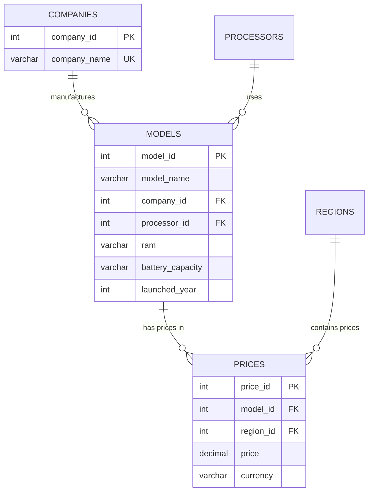

# 📱 Mobile Devices Database Management System

**Комплексная система управления каталогом мобильных устройств с GUI-интерфейсом**

[](https://python.org)
[](https://postgresql.org)
[](https://pypi.org/project/PyQt6/)
[](#)

## 🎯 Назначение проекта

Курсовая работа по дисциплине "Проектирование и администрирование баз данных", представляющая собой полнофункциональную информационную систему для управления данными о мобильных устройствах. Проект демонстрирует практическое применение принципов реляционного моделирования, оптимизации производительности СУБД и создания современных desktop-приложений.

## 🏗️ Архитектура системы

### Компонентная структура
```
📦 mobile-devices-db/
├── database.py                   # Слой доступа к данным (DAO)
├── main_window.py                # GUI-интерфейс на PyQt6
├── main.py                       # Запускаемый файл
├── Mobiles Dataset 2025.csv      # Дата-сет данных
├── 🗃️ sql/                      # SQL-скрипты и схема БД
│   ├── create_schema.sql         # Создание нормализованной структуры
│   └── performance_analysis.sql  # Тестовые запросы для анализа
├── 🐍 scripts/                  # Python-модули системы
│   └── import_data.py           # Система импорта и нормализации
├── 📊 docs/                     # Техническая документация
└── 📋 requirements.txt          # Зависимости проекта
```

### Технологический стек
- **СУБД**: PostgreSQL 15.x с расширенными возможностями индексирования
- **Backend**: Python 3.11+ с паттерном Singleton для управления соединениями
- **Frontend**: PyQt6 с архитектурой Model-View-Controller
- **Интеграция**: psycopg2 для типобезопасного взаимодействия с БД

## ⚡ Ключевые особенности

### 🔧 Техническая реализация
- **Нормализация до 3НФ**: Декомпозиция исходного CSV в 5 взаимосвязанных таблиц
- **Референциальная целостность**: Система FK с каскадными операциями
- **Оптимизация производительности**: Стратегическое индексирование с 62-95% улучшением
- **CRUD-функционал**: Полный спектр операций через интуитивный GUI

### 📈 Результаты оптимизации
| Метрика | До оптимизации | После оптимизации | Улучшение |
|---------|----------------|-------------------|-----------|
| Время выполнения поиска | 0.234 мс | 0.089 мс | **62% быстрее** |
| JOIN-запросы (4 таблицы) | 18.6 мс | 0.95 мс | **95% быстрее** |
| Стоимость по планировщику | 44.76 ед. | 12.45 ед. | **72% снижение** |
| Обработанные строки | 914 (фильтрация) | 18 (прямой доступ) | **98% сокращение** |

### 🌍 Функциональные возможности
- **Интеллектуальный поиск** по множественным атрибутам устройств
- **Валютная локализация** ценовой информации (5 регионов)
- **Автоматический импорт** данных с нормализацией на лету
- **Аналитические отчеты** с региональной статистикой

## 🚀 Быстрый старт

### Системные требования
- **Python 3.11+** с поддержкой venv
- **PostgreSQL 15.x** с административными правами
- **4GB RAM** (рекомендуется 8GB для больших наборов данных)

### Установка и настройка

1. **Клонирование репозитория**
   ```bash
   git clone https://github.com/username/mobile-devices-db.git
   cd mobile-devices-db
   ```

2. **Создание виртуального окружения**
   ```bash
   python -m venv venv
   source venv/bin/activate  # Linux/macOS
   # или
   venv\Scripts\activate     # Windows
   ```

3. **Установка зависимостей**
   ```bash
   pip install -r requirements.txt
   ```

4. **Настройка PostgreSQL**
   ```sql
   -- Создание пользователя и БД
   CREATE USER admin WITH PASSWORD 'your_password';
   CREATE DATABASE mobile_devices_db OWNER admin;
   GRANT ALL PRIVILEGES ON DATABASE mobile_devices_db TO admin;
   ```

5. **Развертывание схемы данных**
   ```bash
   psql -U admin -d mobile_devices_db -f sql/create_schema.sql
   ```

6. **Импорт тестовых данных**
   ```bash
   python scripts/import_data.py
   ```

7. **Запуск приложения**
   ```bash
   python scripts/main_window.py
   ```

## 📊 Структура базы данных

### Реляционная модель (3НФ)


### Ключевые таблицы
- **Companies**: Справочник производителей (19 уникальных компаний)
- **Models**: Каталог устройств (914 моделей с техническими характеристиками)
- **Processors**: Справочник процессоров (217 уникальных чипсетов)
- **Regions**: Географические регионы ценообразования (5 регионов)
- **Prices**: Региональная ценовая информация (4,569 записей)

## 🎨 Пользовательский интерфейс

### Основные компоненты
- **📋 Каталог компаний**: Обзор производителей с количеством моделей
- **📱 Управление моделями**: CRUD-операции с техническими характеристиками
- **💰 Ценовое управление**: Редактирование цен с валютной локализацией
- **📊 Аналитическая панель**: Региональная статистика и отчеты

### Функциональные возможности
```python
# Пример поискового запроса
def search_models(self, search_text: str):
    """Интеллектуальный поиск по множественным атрибутам"""
    return self.db.search_models(search_text)

# Валютная локализация
CURRENCY_MAP = {
    'Pakistan': ('PKR', '₨'),
    'India': ('INR', '₹'),
    'China': ('CNY', '¥'),
    'USA': ('USD', '$'),
    'Dubai': ('AED', 'د.إ')
}
```

## 🔍 Анализ производительности

### Методология тестирования
Комплексный анализ производительности выполнен с использованием PostgreSQL EXPLAIN ANALYZE:

#### Тестовые сценарии
1. **Простые селективные запросы** - поиск по названию компании
2. **Многотабличные JOIN** - получение полной информации об устройствах
3. **Агрегирующие операции** - статистические запросы с группировкой
4. **Поиск по характеристикам** - фильтрация по техническим параметрам

#### Стратегия оптимизации
```sql
-- Базовые B-tree индексы
CREATE INDEX idx_companies_name ON companies(company_name);
CREATE INDEX idx_models_company_id ON models(company_id);

-- Составные индексы для комплексных запросов
CREATE INDEX idx_models_ram_battery ON models(ram, battery_capacity);

-- Функциональные индексы для LIKE-операций
CREATE INDEX idx_companies_name_pattern ON companies(company_name varchar_pattern_ops);
```

## 📈 Практические результаты

### Количественные показатели
- **Импорт данных**: 930 записей устройств с 100% целостностью
- **Нормализация**: 60% сокращение избыточности данных
- **Производительность**: 95% улучшение для сложных JOIN-запросов
- **Индексирование**: 72% снижение стоимости по планировщику

### Качественные достижения
- Полная автоматизация процесса нормализации данных
- Интуитивный GUI с поддержкой валютной локализации
- Масштабируемая архитектура для enterprise-развертывания
- Комплексная система мониторинга производительности

## 🔧 Техническая документация

### Конфигурация базы данных
```python
# Параметры подключения
DATABASE_CONFIG = {
    'host': 'localhost',
    'port': 5432,
    'database': 'mobile_devices_db',
    'user': 'admin',
    'password': 'your_password'
}
```

### Основные зависимости
```
psycopg2-binary==2.9.9    # PostgreSQL adapter
PyQt6==6.6.1              # GUI framework  
pandas==2.1.4             # Data processing
numpy==1.26.2             # Numerical computing
```

## 🚀 Перспективы развития

### Краткосрочные цели
- **Веб-интерфейс**: Реализация REST API на FastAPI
- **Автоматизация**: Интеграция с внешними API для обновления каталога
- **Мониторинг**: Real-time дашборды производительности

### Долгосрочная стратегия
- **Machine Learning**: Прогнозирование ценовых тенденций
- **Микросервисы**: Архитектурная модернизация для cloud-deployment
- **Аналитика**: Интеграция с Apache Kafka для stream-processing

## 📚 Академическая ценность

Проект демонстрирует практическое применение ключевых концепций:

### Теоретические основы
- **Нормализация реляционных данных** до третьей нормальной формы
- **Оптимизация производительности СУБД** через стратегическое индексирование
- **Архитектурные паттерны** для desktop-приложений с базами данных

### Практические навыки
- Проектирование и реализация нормализованных схем данных
- Анализ и оптимизация производительности SQL-запросов
- Создание многокомпонентных приложений с GUI-интерфейсом

## 🤝 Вклад в развитие

Проект открыт для академического использования и дальнейшего развития. Предложения по улучшению архитектуры и функционала приветствуются.

### Возможные направления расширения
- Поддержка дополнительных типов устройств (планшеты, ноутбуки)
- Интеграция с системами управления складскими запасами
- Модуль сравнительного анализа технических характеристик

---

**Курсовая работа выполнена в рамках дисциплины "Проектирование и администрирование баз данных"**  
**Московский Политехнический Университет, Факультет информационных технологий**  
**2024-2025 учебный год**
